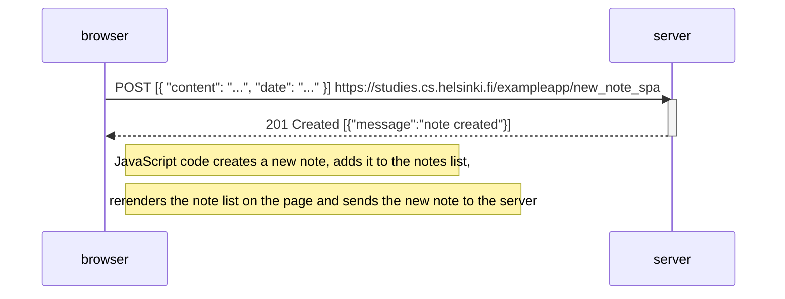

```mermaid
sequenceDiagram
    participant browser
    participant server

    browser->>server: POST [{ "content": "...", "date": "..." }] https://studies.cs.helsinki.fi/exampleapp/new_note_spa
    activate server
    server-->>browser: 201 Created [{"message":"note created"}]
    deactivate server

    Note right of browser: JavaScript code creates a new note, adds it to the notes list,
    Note right of browser: rerenders the note list on the page and sends the new note to the server
```
    